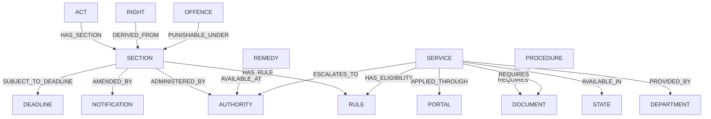

# CivicSphere Knowledge Graph Model

## 1. Supported Domain Entity Types

Module C uses strongly typed domain labels:

```
ACT               SECTION           SUBSECTION        RULE
REGULATION        NOTIFICATION      ORDER             COURT
JUDGMENT          AUTHORITY         RIGHT             DUTY
REMEDY            OFFENCE           PENALTY           PROCEDURE
DOCUMENT          SERVICE           SCHEME            DEPARTMENT
MINISTRY          STATE             DISTRICT          ELIGIBILITY
FEE               PORTAL            GRIEVANCE         APPEAL
DEADLINE
```

---

## 2. Supported Explicit Relationships



---

## 3. Query Security and Parameterization

- All Cypher queries use parameterized inputs (e.g. `$act_id`, `$section_name`, `$limit`).
- Traversal depth is strictly capped at `DEFAULT_DEPTH = 2`, `MAX_DEPTH = 3`.
- Bounded neighborhood queries return the primary node and 3–10 related edges to prevent graph explosion.
- Arbitrary Cypher execution is strictly prohibited.
