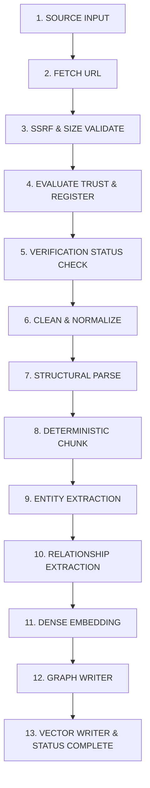

# Ingestion Pipeline Specification

## 1. 13-Stage Pipeline Sequence

---

## 2. Chunking Guarantees

- Chunks preserve section numbering, section title, chapter name, act title, and jurisdiction.
- Chunks are bounded to a maximum of 1,200 characters with 15% sliding window overlap when splitting long sections.
- Every chunk receives a deterministic SHA-256 content hash and globally unique ID `chk_{source_id}_{version}_{index}`.
